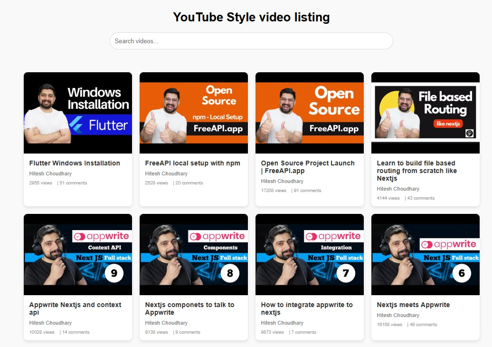

# YouTube Card Project

A simple and elegant YouTube video card layout built with HTML, CSS, and JavaScript. This project fetches video data from an API and displays it in a responsive grid layout with search functionality.

## Features
- **Responsive Design**: The layout adjusts to different screen sizes, displaying 4 cards per row on larger screens.
- **Search Functionality**: Users can search for videos by title or channel name.
- **Modern Design**: Includes shadows, hover animations, and a clean UI.
- **Dynamic Content**: Videos are fetched from an API and rendered dynamically.

## Technologies Used
- HTML
- CSS (Grid Layout)
- JavaScript (Fetch API)

## How to Use
1. Clone the repository or download the files.
2. Open `index.html` in your browser.
3. Use the search bar to filter videos by title or channel name.

## API Used
This project uses the [FreeAPI](https://api.freeapi.app/) to fetch YouTube video data.

## Screenshot

youtubestyle.jpg

## Git
Git Repository : 

## Vercel
Vercel URL : 