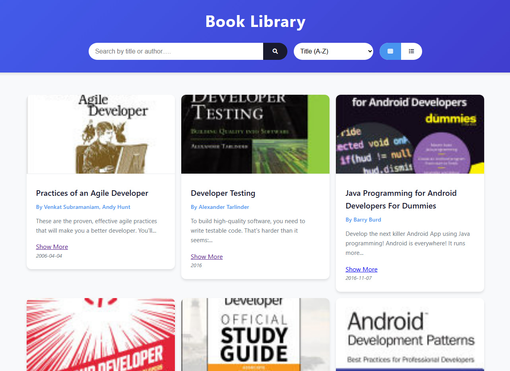
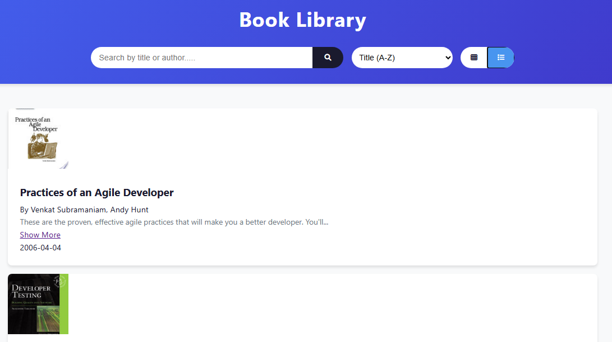
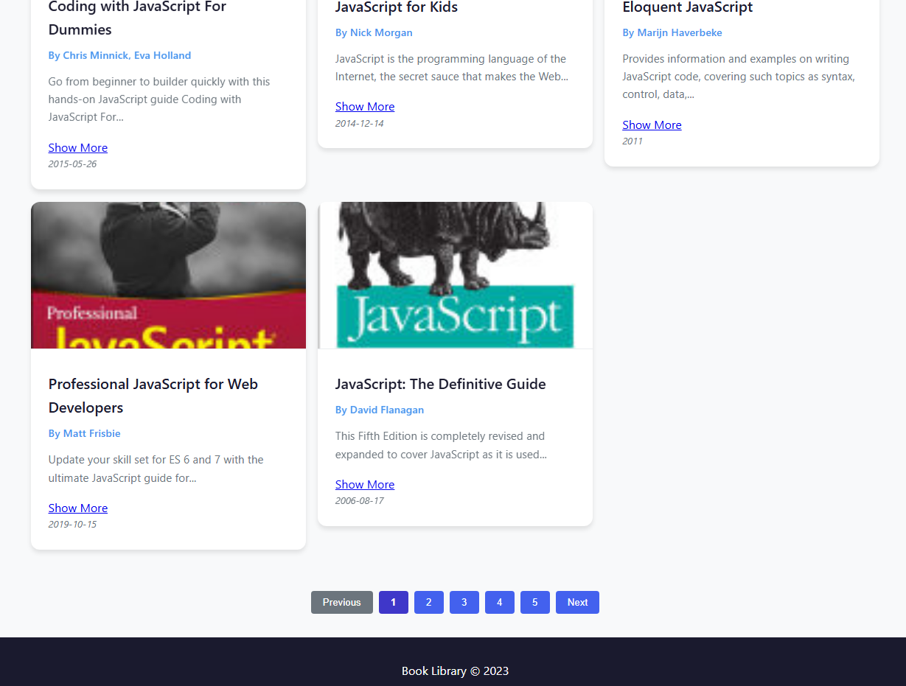

# Book Library Application

A web-based Book Library application that allows users to browse a collection of books, search by title or author, sort by different criteria, and toggle between grid and list views.

## Features

- **Search Functionality**: Search books by title or author using a search bar.
- **Sorting Options**: Sort books by title (A-Z, Z-A) or by publication date (oldest to newest, newest to oldest).
- **Grid and List View**: Toggle between grid and list views for better display preferences.
- **Pagination**: Navigate through pages of books with pagination controls (Next, Previous, and page numbers).
- **Book Details**: View book information such as title, author, description, and publication date. Option to open a preview link for more details.

## Screenshots

### Grid View

### List View

### Pagination

## Deployment Link

You can access the deployed Book Library Application here:  
[**Book Library App**](https://your-deployment-link-here.com)

1. **Clone the Repository**:

    git clone https://github.com/your-username/book-library-app.git

## Technology Stack

- **Frontend**: 
    - HTML, CSS, JavaScript
    - Fetch API for retrieving books
    - Font Awesome for icons
- **API**: 
    - The application fetches books using the free API from [https://api.freeapi.app](https://api.freeapi.app).
  
## Contributing

If you'd like to contribute to the development of this project, feel free to fork the repository and submit a pull request. Please ensure that your changes do not break existing functionality and include appropriate test coverage where necessary.
