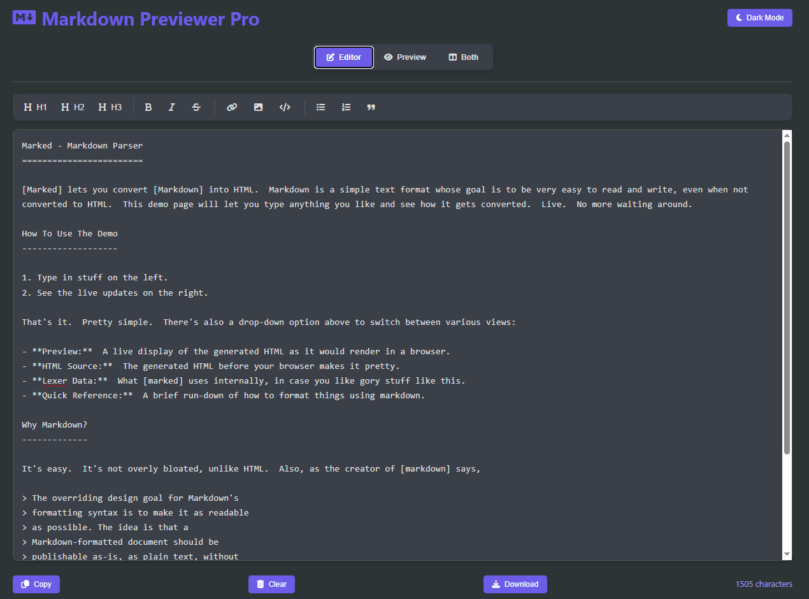

# Markdown Previewer Pro

A feature-rich Markdown editor with live preview, syntax highlighting, and multiple viewing modes. Perfect for writers, developers, and content creators who work with Markdown.

## Features

- **Real-time Preview**: Instantly see how your Markdown renders
- **Multiple View Modes**:
  - Editor only
  - Preview only
  - Split view (editor + preview)
- **Syntax Highlighting**: Beautiful code blocks with language support
- **Toolbar**: Quick access to common Markdown formatting
- **Dark/Light Mode**: Choose your preferred theme
- **Export Options**:
  - Copy to clipboard
  - Download as .md file
- **Keyboard Shortcuts**:
  - Tab = 4 spaces
  - Ctrl+B = Bold
  - Ctrl+I = Italic
- **Persistent Storage**: Automatically saves your work
- **Responsive Design**: Works on desktop and mobile devices

## Installation

1. Clone the repository:
   git clone https://github.com/Tanxeem/Web-Dev-Cohort/tree/main/05%20Markdown%20Previewer

   ## vercel
link - https://markdown-previewer-pro.vercel.app/

(markdown-previewer-pro-preview.png)(markdown-previewer-pro-light-mode.png)(markdown-previewer-pro-both.png) 
